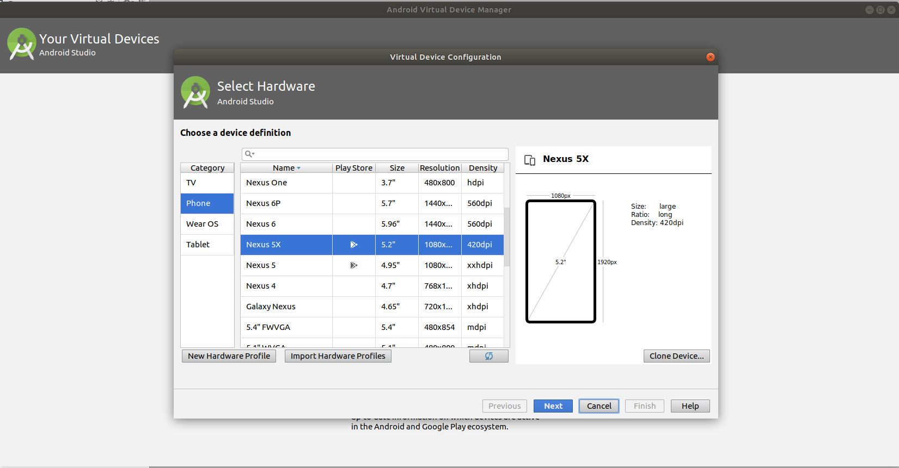
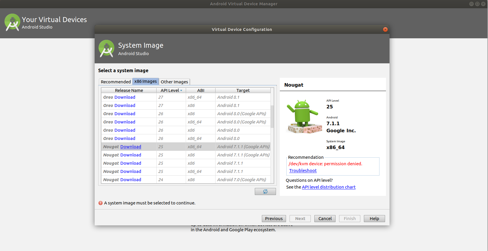
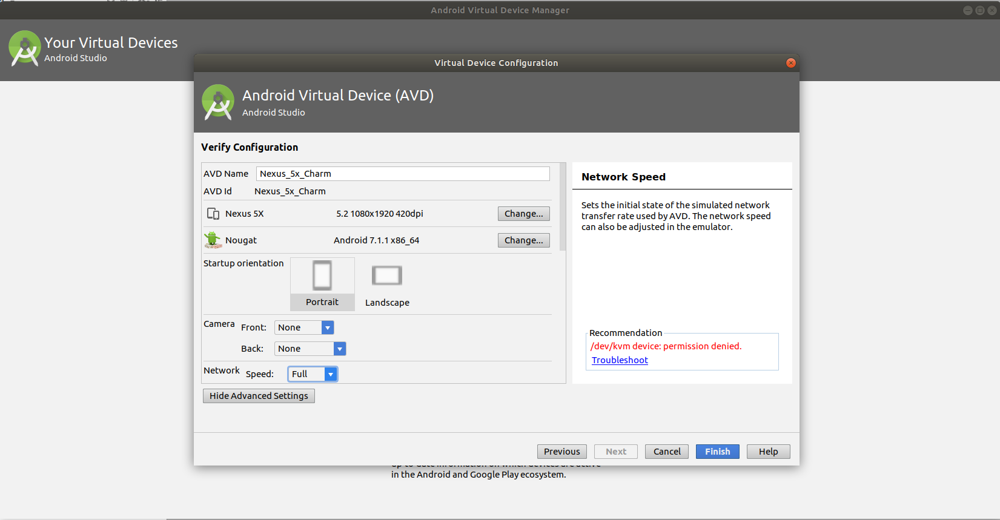

# Build Charm from Source

Copyright (c) 2016-2018 University of California, Irvine. All rights reserved.

Authors: Seyed Mohammadjavad Seyed Talebi and Hamid Tavakoli, UC Irvine; Hang Zhang and Zheng Zhang, UC Riverside; Ardalan Amiri Sani, UC Irvine; Zhiyun Qian, UC Riverside 

This document is shared under the GNU Free Documentation License WITHOUT ANY WARRANTY. See https://www.gnu.org/licenses/ for details.
_____________________________

Charm facilitates dynamic analysis of device drivers of mobile systems. This document is a toturial to build Charm on Linux. 

Please refer to our paper for technical details: [USENIX paper](http://www.ics.uci.edu/~ardalan/papers/SeyedTalebi_USENIX_Security18.pdf)

## Prerequisites

It is strongly recommended to backup your system before proceeding.

### Hardware
You need to access to a linux machine with at least 4GB of RAM and 200GB storage.  

### Software
The instruction has been tested on a linux server with ubuntu 16.4. you need to install the build essentials for each project prior to build them. 

## Charm organizaiton

Charm system consists of five main components:
- Phone OS (Lineage OS Android for Bullhead)
- Android emulator 
- Host OS (Ubuntu)
- Syzkaller
- VM OS (AOSP Android for goldfish)

In following section we show how to build these components from source.
**Note: Please use our exact Naming convention for  files and directories.
**
first make a directory for Charm project  and cd to it.
```bash
mkdir Charm && cd Charm
```
then make a directory for each component of Charm.
```bash
mkdir bullhead_lineage
mkdir goldfish_AOSP
mkdir Android_emulator
mkdir Host_Ubuntu
mkdir Syzkaller
```
_____________________________

### build Phone OS

You can skip build process and download a built image from [here](https://drive.google.com/file/d/1W77VjxRwsZLM1T96mqqWJODWpfV54JBX/view) or you may build from the source as following:

#### Download source code
Follow the documention for building Lineage OS (version cm-14.1) for bullhead, from [here](https://wiki.lineageos.org/devices/bullhead/build "here").
Note: you need to change these two lines of the documentation:

~~cd ~/android/lineage
repo init -u https://github.com/LineageOS/android.git -b lineage-15.1~~  
Instead use:
```bash
cd Charm/bullhead_lineage
repo init -u https://github.com/LineageOS/android.git -b cm-14.1
```
Note: It might take a few hours to finish. <br />
Note: Repo needs "python" to run. Python is not installed by default in recent distributions of Ubuntu. install python using: `$ sudo apt install python-minimal`
#### Apply changes
Considering you are in `Charm/bullhead_lineage/` directory, In order to apply our changes, perform following steps:
```bash
cd kernel/lge/bullhead
git remote add charm_origin https://github.com/trusslab/charm_bullhead_kernel.git
git fetch charm_origin
git checkout -b Charm charm_origin/Charm
```
go back to `Charm/bullhead_lineage/`, then:
```bash
cd system/core
git remote add charm_origin https://github.com/trusslab/charm_bullhead_core.git
git fetch charm_origin
git checkout -b Charm charm_origin/Charm
```
go back to `Charm/bullhead_lineage/`, then:
```bash
cd frameworks/native
git remote add charm_origin https://github.com/trusslab/charm_bullhead_native.git
git fetch charm_origin
git checkout -b Charm charm_origin/Charm
```
#### Build
To build the system go back to `Charm/bullhead_lineage/`, and run:
```bash
 source ./build/envsetup.sh
 brunch lineage_bullhead-eng
```
Note: You might need to run `export LANG=C` prior bruch command if you are using newer ubuntu distributions for building.

#### Install on the Phone
After build proccess finshes you need to Install the Android on your phone.  Connect your Nexus5x Phone to your system and run:
```bash
adb reboot recovery
```
In recovery menu please select `adb-sideload`. 
Assuming you are in `Charm/bullhead_lineage/`you can reach the OUT directory where all built images are, using:
```bash
cd out/target/product/bullhead 
```
You can find the LineageOS installer package under the name `lineage-14.1-[DATE]-UNOFFICIAL-bullhead.zip` (in which [DATE] is replaced with date of your build). To install the package on your phone:
```bash
adb sideload  lineage-14.1-[DATE]-UNOFFICIAL-bullhead.zip
```
Lineage OS 14-1 for bullhead is compatible with n2g47f vendor image, you might need to update your phone's vendor image if it has a different image. You can find n2g47f images [here](https://drive.google.com/file/d/1ZPsOIP6xReLNm8vGz8lE-cXPgFJb1u8T/view?usp=sharing). It is recommanded to update radio and bootloader images to n2g47f as well. 
_____________________________
 ### build Android emulator
 #### Download source code
downlaod the source for android emulator from Google. Assume you are in `Charm/` directory:
```bash
cd Android_emulator
repo init -u https://android.googlesource.com/platform/manifest -b emu-2.4-release
repo sync
```
#### Apply changes
then you need to apply Charm changes to the QEMU. 
```bash
cd external/qemu
git remote add charm_origin https://github.com/trusslab/charm_emulator.git 
git fetch charm_origin
git checkout -b Charm charm_origin/Charm
```
#### Build
in order to build the emulator:
```bash
./android/rebuild.sh
```
Note: the expected output should look like this:
```console
Configuring build.
Building sources.
Checking for 'emulator' launcher program.
Checking that 'emulator' is a 64-bit program.
Running 64-bit unit test suite.
   - android_emu64_unittests
   - emugl64_common_host_unittests
   - emulator64_libui_unittests
   - emulator64_crashreport_unittests
   - lib64OpenglRender_unittests
   - lib64GLcommon_unittests
Running emugen_unittests.
Running emugen regression test suite.
Running gen-entries.py test suite.
ERROR: Unit test failures:  android_emu64_unittests
```
_____________________________

### build Host OS
 #### Download source code
download the operating systme for the host. 
```bash
cd Host_Ubuntu
git clone https://github.com/trusslab/charm_host_kernel.git -b Charm
```
#### Build
   
First you need to install the prerequisites:
```bash
sudo apt install gawk
sudo apt install debhelper
sudo apt install libudev-dev
sudo apt install pciutils-dev 
sudo apt install libelf-dev
```
Then build the ubuntu using build script.
```bash
cd charm_host_kernel
source build.sh
```
Note: It might take a few hours to finish.

after instalation finishes go back one directory to `Charm/Host_Ubuntu/ `
to install the built Ubuntu on your system:
```bash
sudo dpkg -i linux-*4.10.0-28.32*.deb
```
#### Update the Grub
You need to ubdate the Grub and reboot your machine and boot the new Ubuntu.

_____________________________

### build VM OS
 #### Download source code

download the operating systme for the Charm's VM. 
```bash
cd goldfish_AOSP
git clone https://github.com/trusslab/charm_emulator_kernel.git -b charm_goldfish_camera
```
#### Build
first you need to install prerequisites.
install device tree compiler using
```bash
sudo apt install device-tree-compiler
```
Then you need to get the gcc compiler for building the android as following:
```bash
cd ~/Charm/goldfish_AOSP
mkdir compiler
cd compiler
git clone https://android.googlesource.com/platform/prebuilts/gcc/linux-x86/x86/x86_64-linux-android-4.9
```
Then to build the kernel
```bash
cd ~/Charm/goldfish_AOSP/charm_emulator_kernel
source build_x86_64.sh
```
Then you need to download the [ramdisk.img](https://drive.google.com/open?id=16Tb9zvMJgMMz5OjmD_TPAkgWke2hUVq4), [system.img](https://drive.google.com/file/d/1i9_xYUouLacay61PV1sfNGoOseCF8DdK/view?usp=sharing), [encryptionkey.img](https://drive.google.com/file/d/1NhZAYi2U4L0gvupBg2Oy_-FUB_maWbOc/view?usp=sharing), and the [userdata.img](https://drive.google.com/open?id=19InKHZPvN3zXdLBxldiQ9XUwc9u4dkof) and save them in `~/Charm/goldfish_AOSP/` folder.
_____________________________

### Run Charm emulator
First you need to make an Android Virtual Device(AVD) to run the emulator.
#### Make an AVD
To make an AVD you need to download and install the [latest Android Studio](https://developer.android.com/studio/) first.  
Then open Android Studio, enter 'Cntrl+Shift+a'  to open search menu, then type `AVD manager` and open AVD manager.  
Select Nexus5x in AVD manager.

In the next step you need to check for the Nougat android and an ABI suitable for your machine.

In the next step name your AVD `Nexus_5x_Charm` and set both camera options to `None`.

#### Run Charm emulator using scripts

first you need to download the scripts to run Charm emulator.
```bash
cd ~/Charm/
git clone https://github.com/trusslab/charm.git
```
Then you need to update the scripts using your phone device ID. you can find your phone device ID using:
```bash
adb devices
```
to update the script with your device ID:
```bash
cd ~/Charm/charm/scripts
vim charm_run.sh
```
then edit the DEVICE_ID and run the `charm_run.sh`.
